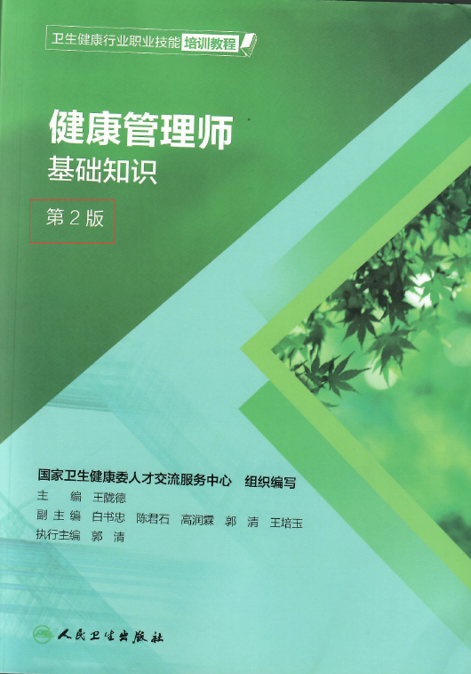
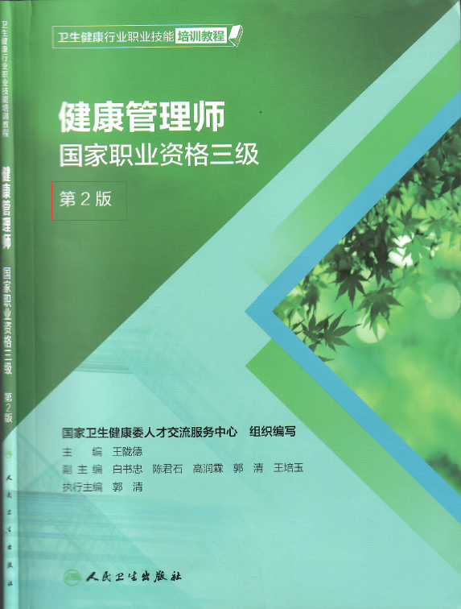

 # 健康管理师的报名地址
   现在**健康管理师**的报名招生信息到处都是，但百度搜索全是机构的广告。很多有志于从事这个行业的人肯定很迷茫。

   经过一段时间的学习与摸索，瘦瘦有一些心得分享给大家**唯一发布鉴定工作通知和信息的官网：[中国卫生人才网](https://www.21wecan.com/rcpj/zyjnjd/)**，
   地址https://www.21wecan.com/rcpj/zyjnjd/。 这可真不好找，还是培训机构告诉我考试推迟到10月份才知道这个网站的。

   报名、查成绩、内容公告应该都在这里了，大家以后可以多关注。

# 健康管理师的报名条件
   健康管理师三级报名条件，应具备以下条件**之一**：
   1. 具有**医药卫生专业**，**大学专科**以上学历证书。
   2. 具有**非医药卫生专业**，**大学专科**以上学历证书，连续从事本职业或相关职业工作**2年**以上，经健康管理师三级**正规培训达规定标准学时数**，并取得**结业证书**。
   3. 具有**医药卫生专业**，**中等专科**以上学历证书，连续从事本职业或相关职业工作**3**年以上，经健康管理师三级**正规培训达规定标准学时数**，并取得**结业证书**。

   瘦瘦将此条件做成表格形式给大家看下。

   |专业 |学历| 相关工作年限 |培训|证书|
   |:---:|:---|---:|:---:|:---|
   |医药卫生|大学专科以上||||
   |医药卫生|中等专科以上|3年以上|需培训|结业证书|
   |非医药卫生|大学专科以上|2年以上|需培训|结业证书|

   所以如果是非医药卫生专业，或医药卫生专业的中专学历人员，均需要去培训机构报名、学习，达到规定标准学时数。

# 健康管理师的教材
   培训机构发了两本教材。
   这一本基础知识，也叫做理论，内容比较多，有十六章内容。
   
   这一本职业资格三级，也叫做技能，有四章内容，一章实习内容。
   
   
# 健康管理师的考试形式
   健康管理师考试共分为理论考试、技能考试两场，两场都过才算考试合格。两场都采用**人机对话考试**，也就是机考。
   **特别要注意的是**，并不是说上午考基础知识这本书，下午考职业资格这本书，而是上午综合考两本书的内容，下午也综合考两本书的内容。只不过题型的呈现方式不同而已。

# 健康管理师的题型
   瘦瘦根据所报名培训机构老师的讲解，列出考试题型及时间，如果不正确，请大家私信QQ邮箱：2148348106@qq.com。

   |科目|时间|时长|题型|合格|方式|备注|
   |:---:|:---|---:|:---:|:---|---:|:---|
   |理论知识|9:00-11:00|120分钟|70单选*1=70分，30多选*1=30分|60分|机考客观题|多算题少选多选都没分|
   |操作技能|14:00-16:00|120分钟|58单选*1=58分，42多选*1=42分|60分|机考客观题|共用题干|

# 健康管理师题目举例
   因为不知道真正的真题是什么，把百度的题目贴两个给大家看看。

   ## 上午单选题举例

   儿童的身高组别体重的正常范围是（ ）

　　A. 2个标准差范围内

　　B. 2.5个标准差范围内

　　C. 3个标准差范围内

　　D. 1.5个标准差范围内

　　E. 1个标准差范围内

  ## 上午多选题举例

  健康风险评估的作用包括（ ）

　　A. 健康干预措施的制订

　　B. 健康危险因素的认识

　　C. 健康保险费用的预测

　　D. 健康管理人群的分类

　　E. 健康干预措施的实施

## 下午单选题举例

某老年社区为提高辖区内老年糖尿病患者的管理水平，引进某健康管理机构为糖尿病患者进行服务,对不同糖尿病患者分别开展常规管理和强化管理,并在管理一年后进行年度考核。

有关糖尿病患者自我血糖监测的描述不正确的是(  )

A. 使用胰岛素治疗者在治疗达到治疗目标后每日监测血糖五次

B. 病情稳定或已达血糖控制目标者, 每日监测1~2次

C. 血糖控制差或病情危重者每周监测血糖4~7次

D. 使用口服药和实施生活方式干预的患者达标后每日监测血糖2 ~4次

E. 使用胰岛素治疗者在治疗开始阶段，每日至少监测血糖五次

## 下午多选题举例
某城乡结合部社区卫生服务中心对辖区内居民健康档案进行整理发现,糖尿病和高血压的患病率逐年上升,医护人员发现随着城镇化加速和生活方式的改善,辖区内居民的肥胖比例逐渐增加,为控制慢性病的发生,医护人员拟针对居民的肥胖开展一系列干预措施。

该城乡结合对肥胖合并并发症的患者进行干预包括( )

A.指导相应药物治疗方法  

B.膳食干预

C.自我检测体重

D.定期随访

E.体力活动干预

F.动员家属配合

G.组织朋友座谈会交流和控制体重的经验

# 到底要不要考“健康管理师”

2020年01月03日，在中国卫生人才网，刊登了一篇由中华医学会健康管理学分会候任主委，郭清教授写的文章[《理性看待“健康管理师热”》](https://www.21wecan.com/rcpj/zyjnjd/gzdt_12051/202001/t20200103_8398.html)。
。

我觉得每一准备考取健康管理师的人，在报考之前都应该认真读一下这篇文章。

下面瘦瘦将自己认为比较重要的内容列出来，和大家切磋探讨。
 
 1. “健康管理师”是 健康服务与管理的提供者之一
   
    > 健康服务与管理的提供者有：医生、护士、健康管理师、营养指导员、心理咨询师、医疗护理员、养老护理员等，健康管理师是众多健康服务人群中的一员。

2.  “健康管理师”的工作岗位

     > 健康管理师的主要工作岗位是在社区卫生服务机构、健康体检（管理）中心、健康保险公司、健康管理公司和相关企业等。

3.  “健康管理师”与其他执业人员区别

    > 健康管理师与执业医师、执业护士、执业药师的职能不同，不能完全替代后者。
 
4. “健康管理师” 通过率为40%左右
    
    > 多数人原本希望通过参加社会上的健康管理师培训，可以顺利获得健康管理师执业资格证书，实际上花了大量时间、静力、培训费，却成为冤大头。

5. 警惕社会上“健康管理”虚假宣传和培训乱象
    
   > 部分培训机构师资力量不足，培训质量无法保证，学员学习满意度低。
   

6. “健康管理师”是技能类非准入类证书

    > 目前，从国家政策层面，尚无针对健康管理师职业的工作岗位的硬性要求。

    > 健康管理师证书属于技能类的**非准入类**证书，该证书仅证明**达到了从事该职业相应的知识和技能水平**。

    > 国家人力资源与社会保障部2017年发布职业资格目录时明确强调，**目录之内除准入类职业资格外一律不得与就业、创业挂钩**，国家法律并没有明确规定必须持证才能上岗。

# “健康管理师”工资

因为每天打开手机、电脑，都是动辄几十万的薪酬，其实从准入门槛来看，也就是报考条件来看，要想达到广告吹嘘的那样高工资，我觉得不太现实。高工资当然有，但如果没有在行业一段时间的积累，而仅仅靠一张证书是不可能的。

所以瘦瘦建议大家去智联招聘、猎聘等大型招聘网站搜索下，了解一下目前健康管理师的招聘待遇，通常招聘的薪酬都是高于实际给付的薪酬吧，看一下招聘要求，是不是自己准备投身奋斗的行业，大家心里有个数，确实不能盲目更风。

# 瘦瘦认为的健康管理之路

以我目前学习所得，考试的健康管理主要针对常见慢性病的了解与预防，主要包括：肥胖、高血压、糖尿病、心脏病等的管理。

但事实上，作为一个二胎妈妈，我每天都在遭受**失眠**的困扰，这似乎不是病，但却影响了健康。我想通过自己的努力，来改变这一切。既然已经这样了，也只能想办法去学习、去尝试、去克服，所以瘦瘦认为健康管理的路很长，它的大宗旨是“治未病”，防患于未然。

瘦瘦现在这个年纪，真正体会到了**上有老、下有小**的难处。自己不敢病，因为得照顾老人和小孩，也在天天祈祷老人、小孩不要生病，且不说看病、挂号的难处，单说频繁请假都让工薪族吃不消。

其实，说老实话，我已经保持自己很多年都不生病了。从准备怀孕的时候就知道病了对胎儿不好，怀孕了也不敢病，害怕通过胎盘传染给孩子。生产完更不敢病，因为病了难免会传染给孩子，还得带他去医院排队挂号。所以就这样我小心翼翼的照顾着自己和孩子，一有感冒发烧的端倪，就扼杀在摇篮里。

未来，我希望自己能掌握更多关于健康的知识，照顾好自己和自己的家人。所以学习健康管理，我是认真的，只是作为一个普通人的生活需要。但我认为，有必要系统学习下，这样理论更丰富，能更好的指导实践，于是我报考了健康管理师考试。

# 如果你想报考，大家一起努力
瘦瘦目前，是基于自己备考的需要，来建设这个网站。希望我在上面整理、发布的内容，能帮助到你。

当然，我会一直建设下去。因为我觉得做健康管理，即使通过了考试，不仅知识需要不断更新，旧的知识也不能忘记。所以即使通过了考试，也要在工作生活中不断强化、巩固所学。

所以我希望，我可以做到，如果以后你有需要，直接到瘦瘦的网站来搜索即可，而不是去想我的书在哪呢？我记得在哪一页来着？

如果你有其它需要瘦瘦提供的内容或形式，请Email：2148348106@qq.com，我会尽量满足大家。但碍于精力有限，速度可能会慢一些，但我想，至少能给还在路上的未来健康管理师使用也是好的。

   
   

   

   

   